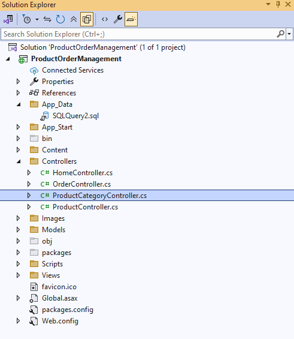
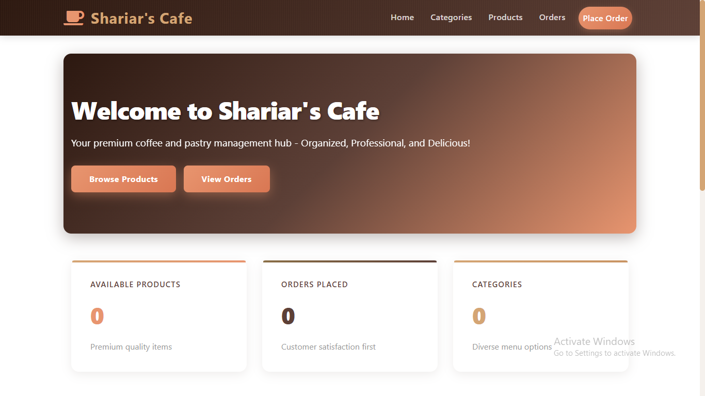
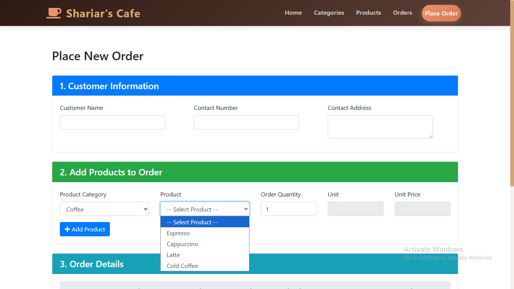
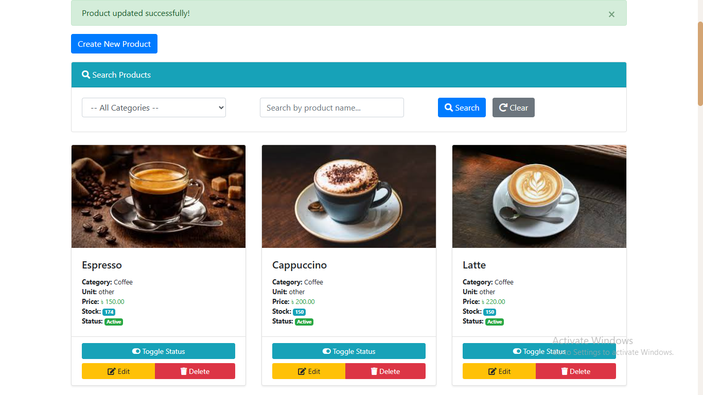
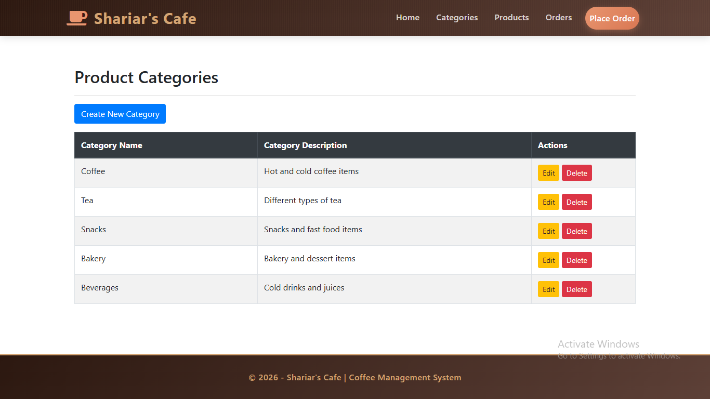
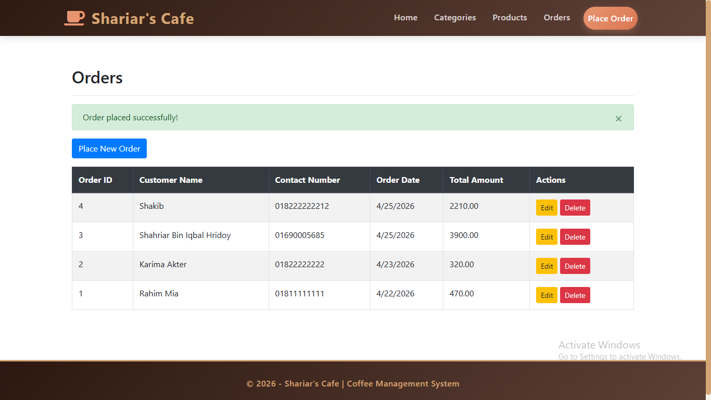

# Product Order Management System - ASP.NET MVC

## Project Overview
This repository contains a robust web-based Order Management System developed using **ASP.NET MVC** and **Entity Framework (Database First approach)**. The application is designed to handle complex relational data, specifically focusing on seamless **Master-Details CRUD operations** for managing customers, products, categories, and multiple order items within a single transaction.

## Project Architecture
The project follows a strict MVC pattern with a clear separation of concerns, utilizing Data Transfer Objects (ViewModels) to pass data safely between the controllers and views.

## Application Interfaces
Here are some key snapshots of the application demonstrating the user interface and core functionalities:

### Dashboard / Home
* **Home Page:** The central hub providing a clean interface to navigate through the application.
  

### Order Management (Master-Details)
* **Order Details & Grid:** A complex form handling the 'Master' record (Customer Info) and allowing the dynamic addition of multiple 'Details' records (Products) using jQuery and AJAX before form submission.
  

### Inventory & User Management
* **Product Management:** Interface for managing products, including image uploads and stock tracking.
  
* **Category Management:** Interface for categorizing products efficiently.
  
* **Customer Management:** Dashboard to manage customer records and contact details.
  

## Technical Highlights & Core Implementations
* **Database First Architecture:** Leveraged Entity Framework (`.edmx`) to generate domain models directly from a normalized MS SQL Server database.
* **Complex Master-Details Handling:** Engineered the `OrderController` to handle complex view models containing both customer data and a list of order items simultaneously.
* **Transaction Management:** Implemented `System.Transactions.TransactionScope` to ensure ACID properties during order placement. If a product goes out of stock or an error occurs during the save process, the entire transaction (Customer, Order, OrderDetails, and Inventory updates) is safely rolled back.
* **Client-Side Dynamics:** Extensively used **jQuery and JavaScript** in the views to manipulate the DOM, allowing users to add, edit, and remove order items from an HTML table dynamically without reloading the page.
* **Real-time Inventory Tracking:** Built-in logic within the controllers to automatically deduct available stock when an order is placed and restore stock if an order is deleted or modified.
* **ViewModels Implementation:** Used ViewModels (e.g., `OrderMasterViewModel`, `ProductViewModel`) to encapsulate presentation logic and prevent over-posting attacks.

## Technology Stack
* **Framework:** ASP.NET MVC 5
* **Language:** C#
* **ORM:** Entity Framework 6 (Database First)
* **Database:** MS SQL Server
* **Frontend:** HTML5, Bootstrap, Razor View Engine (`.cshtml`)
* **Client-Side Scripting:** JavaScript, jQuery, AJAX

